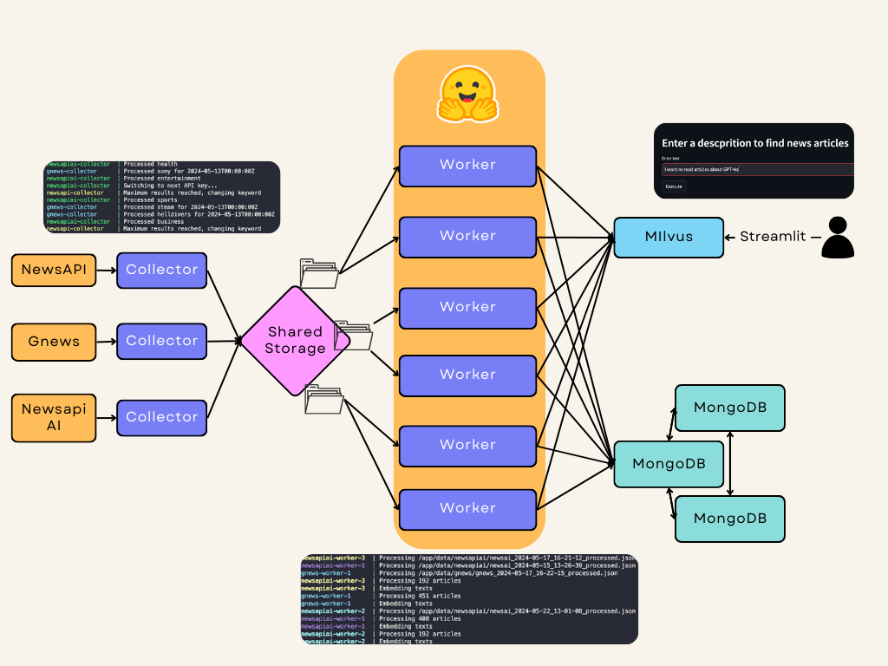

# Big Data Infrastructure

This repository serves as a comprehensive news collector, leveraging JSON-returning APIs. The codebase is designed for scalable deployment, both horizontally (utilizing multiple API keys) and vertically (utilizing multiple APIs).

The primary objective of this project is to establish a robust news aggregation system capable of populating a database (MongoDB). News articles are categorized by user-defined topics, enabling efficient API request management and topic-based data segregation. Once all that is done, we take partial data and insert it into a vectorized database (Milvus), so we can ask for articles based on a topic, a phrase or what ever text context we provide.

<p align="center">
  
</p>

## Gathering Structure

To enhance accessibility, this project is supported by containerization. The structural components include:

- **dockerfiles**: Contains various dockerfiles utilized by the containers in case Docker Hub is down.
- **collector-compose.yml (Collector)**: Creates containers for news collection, with one container per API image.
- **mongo-compose.yml (MongoDB)**: Orchestrates containers for the MongoDB database. A replicaset of 3 mongodb instances. Also includes a jupyter notebook container to run commands in the replica-set if needed (as well as testing).
- **milvus-compose.yml (Milvus)**: Creates the Milvus database for storing the vectorized data. Same as mongo-compose, it includes a jupyter notebook.
- **worker-compose.ylm**: Poblates both databases, MongoDB with purely crude data (a bit modified in order to have the same extructure between API responses), Milvus with low weight informative data and the vectoricez information.
- **requirements.txt**: Lists dependencies required for code execution.
- **src**: Contains various .py files utilized by the images.
- **.env (MUST BE CREATED BY THE USER FOLLOWING .env.example)**: Safely stores API keys to prevent exposure in the code. Can be modified by the user to select topics as well as timeframe for the extraction. Language determines the language of the articles and newsapi-ai tokes per api indicates teh number of call allows per apikey of that API. 
- **notebooks**: Jupyter notebook files are saved here.
- **raw-data**: Docker volume shared by workers and collectors to save and process raw API responses.

While it's feasible to run this system on a single machine, utilizing a cluster of machines is recommended to accommodate scalability. For this project docker swarm was contemplated, but difficulty in node connections forced us to reduce the scale to one node.

## Data

Leveraging the RESTful nature of news APIs, data is acquired in JSON format, enabling seamless integration with MongoDB. Data scalability is achieved through multiple APIs and API keys, facilitating concurrent requests and higher request rates. Data availability is contingent upon API uptime.

With MongoDB, data management is delegated to the database, necessitating sufficient replicas to match the pace of API data retrieval. Data retrieval can be facilitated using MongoDB interfaces such as Compass or Python library pymongo.

For the Milvus part, not only is more efficient for vector and low weight data storege, it also provides the powerful tool of similarity-based search. In order to manage the large amount of documents, we use MinIO that loads in RAM only the necessary stuff. It can also be deployed via cluster and have the nodes dispersed across multiple units.

## Big Data Dimensions

Considering the 5 V's of Big Data:

- **Volume**: MongoDB's storage capacity enables handling extensive data volumes, with scalability options (Can be adapted to great volumes of data).
- **Velocity**: Multi-API data collection allows for high-speed data acquisition, subject to API daily limits (more keys, more data).
- **Variety**: While sacrificing variety, data uniformity is maintained as APIs adhere to a consistent structure, streamlining data processing.
- **Veracity**: The credibility of data sourced from news articles ensures high data reliability.
- **Value**: The collected data is versatile, serving as a valuable resource for diverse applications beyond database population.

## Commands & Use

Useful Docker deployment commands:
#### (If first time deploying) Create all images to be used in the infrastructure
```bash
bash build.sh
```

#### (If first time deploying) Initiate communication network for the whole infrastructure and create the shared volume for raw json files
```bash
bash net_vol_creation.sh
```
#### Initiate databases storage
```bash
docker compose -f mongo-compose.yml up
docker compose -f milvus-compose.yml up
```
#### (Once databases are healthy) Initiate the workers
```bash
docker compose -f worker-compose.yml up
```
#### Initiate the news collectors
```bash
docker compose -f collector-compose.yml up
```
#### Initiate streamlit (query purposes)
```bash
bash start-streamlit.sh
```
#### If you want to stop everything
```bash
bash stop_everything.sh
```
**NOTE**: If you are using MacOS write ```sh``` instead of ```bash```.

----
From Docker Hub https://hub.docker.com/search?q=vramososuna these images are used:

- vramososuna/mongo-starter
- vramososuna/newsapiai
- vramososuna/gnews
- vramososuna/newsapi
- vramososuna/jupyter-tester
- vramososuna/milvus-starter
- vramososuna/worker
- vramososuna/user-milvus

#### Usage
In order to correctly run this application you will need to create an .env file that uses the same extructure as described in the .env.example file.
(It is recommended for the _newsapiaitopics_ to be a number of topics divisible by the number of api keys you have and to avoid problems with the API of _NewsApi_ it is advisable to search at most one month ago).

## Theoretical implementation vs real (local) implementation

As it can be seen, we do no use any kind of already established distributed file system implementations, such as hdfs or spark, the reason being that part of our data processing involves creating text embeddings, which requieres calls to HuggingFaces's API. If we ended up using spark, we would have had to make a call to HuggingFace for each news article, which slows down the processing by a lot. Instead, what we did was creating separate folders inside the shared volume and having groups of workers for each api that access the folder constantly searching for unprocessed files. This system works in a way that when a worker accesses teh file, it immediately changes its name so that other workers cant access it, and given that each file is only processed one time, this file wont ever be processed again. Also there are around 1000 documents in each file, so all texts are sent to HuggingFace at the same time, saving lots of time and "emulating" in a way parallel processing and job distribution.

It this was a real scenario, there would be copies of the embedding model's weights for each worker node, with its own gpus to make using spark viable and massively accelerating processing times.

## Functionability

The objective is to design a container-based digital infrastructure to support a system that works with Big Data. In this case, three MongoDB instances are deployed and configured to run on a replica set, providing redundancy and high availability. Storing data in persistent volumes ensures data durability beyond the lifecycle of the containers. These services are essential for storing and managing data collected from news sources. Then, the newsapi-collector, gnews-collector, newsapiai-collector are designed to connect to different APIs (NewsAPI, GNews, and NewsAPI.ai) to collect news. Each service has its own container, allowing for separation of responsibilities and scalability. Using .env files to configure these services facilitates customization and security by not hardcoding API keys in the code or container. The starter service plays an important role in the initial setup of the MongoDB database that is used to store the collected news data, where high availability and fault tolerance for the database is ensured. After verifying the existence of the database and creating the necessary collections, the script closes the connection to MongoDB. This is a good practice to free resources and avoid possible connection leaks. The service of jupyter provides a web-accessible Jupyter Notebook environment, allowing interactive analysis of the collected data. The inclusion of a Jupyter environment underlines the importance of data analysis in this project, facilitating the exploration and visualization of data stored in MongoDB. For the Milvus, as well as with MongoDB we deployed and create the database needed, then shut the connection down.

The news gathering services are adapted to the peculiarities of each API, such as the handling of rate limits or pagination of results, allowing then to process the raw data received and store the results in MongoDB. So, MongoDB acts as the centralized data store for this project (**Recolection**). The MongoDB replica set structure provides a robust solution for managing the data, ensuring its availability and consistency (**Storage**). Finally, the use of an external Docker network (mongo-net and milvus-net) shared between all services facilitates efficient communication between containers, especially important to allow news gathering services to interact with MongoDB instances and Milvus container. The external network ensures that containers can find and communicate with each other no matter which node in the cluster they are running on.

Lastly, the query-based sistem is runing on Milvus, where part of the data is stored (for all the data got to MongoDB). Also, the Jupyter service provides a platform for data analysis, allowing users to explore and visualize the data collected directly from the MongoDB or Milvus database. This is crucial for extracting insights and value from the collected data (**Data Analysis**). In this practice, the main data analysis comes when searching information.

**Availability and Reliability**

- MongoDB Replica Set: Configuring the MongoDB server in a replica set is critical to ensure high availability and fault tolerance. In the event that one node fails, the other nodes can continue to operate, ensuring that the database remains accessible. In addition, replicas allow reading from secondary nodes, thus distributing the load of read operations.

- Automatic Container Restart: The always-on restart policy in the container services configuration ensures that, if a container fails for any reason, Docker will attempt to restart it automatically, minimizing downtime.

- Volumes: it ensures the data will not be lost if any problem with docker.

**Scalability**

- Docker Swarm and Overlay Networks: Although the proposed project does not explicitly use of Docker Swarm, the mention of an external network (mongo-net) suggests future readiness for a distributed environment, such as Docker Swarm. Docker Swarm facilitates horizontal scalability by allowing services to scale across multiple nodes in the cluster. Overlay networking supports communication between distributed containers on different hosts, maintaining network consistency. This will also beneficial to Milvus if deployed as cluster.

- Separate Services for Data Collection: The microservices architecture, with separate container services for different news sources, allows each data collection service to scale independently based on the specific load or demand of each API source.

**Efficiency and Load Management**

- MongoDB Load Balancing and Optimized Queries: The MongoDB replica set not only serves for availability, but also enables effective load balancing, especially with read queries distributed across secondary nodes. Query optimization and proper indexing of collections are essential to maintain data access efficiency.

- The possibility of having multiple workers and news collectors offers the opportunity of adding more processing power to the infrastructure, handling bigger loads of information fasters and more efficiently.

- Thanks to MinIO, in Milvus the data is loaded as it is needed, so no unnecessary memmory is being used.

**Design Decisions and Quality Principles**

The design decisions made in the proposed infrastructure reflect a commitment to quality principles for virtual infrastructures:

- Decoupling and Modularity: Separation of functionality into distinct containers improves maintainability and facilitates the upgradeability and scalability of each component individually.

- Automation and Self-Healing: The use of restart policies and database auto-initialization design promote a self-healing infrastructure that minimizes manual intervention and increases resiliency.

- Resource Optimization: The architecture enables efficient resource management, using the capabilities of Docker, MongoDB and Milvus to adapt to varying workloads and optimize the use of the underlying infrastructure.
